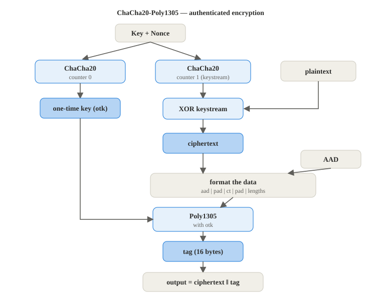

# ChaCha20-Poly1305

**RFC 8439**

**Implementation:** `primitives/chacha20.py`, `primitives/poly1305.py`, `primitives/aead.py`

ChaCha20-Poly1305 is authenticated encryption (AEAD), it hides the message and also makes a
tag that proves the message, and the plain header sent next to it, were not changed.

1. **One time key.** Run ChaCha20 once with the counter at 0 to make a fresh 32byte key,
   used only for this one message's tag
2. **Encrypt.** Run ChaCha20 from counter 1 to make a keystream and XOR it with the plaintext
   to get the ciphertext
3. **Authenticate.** Put the header, the ciphertext and their lengths together, then run
   Poly1305 over them with the one time key to get a 16byte tag
4. **Output.** Send the ciphertext followed by the tag

To decrypt, the receiver builds the tag again and compares it. If even one byte of the
ciphertext or the header changed, the tags differ and the message is rejected. This is the
encryption used for every chat message.

