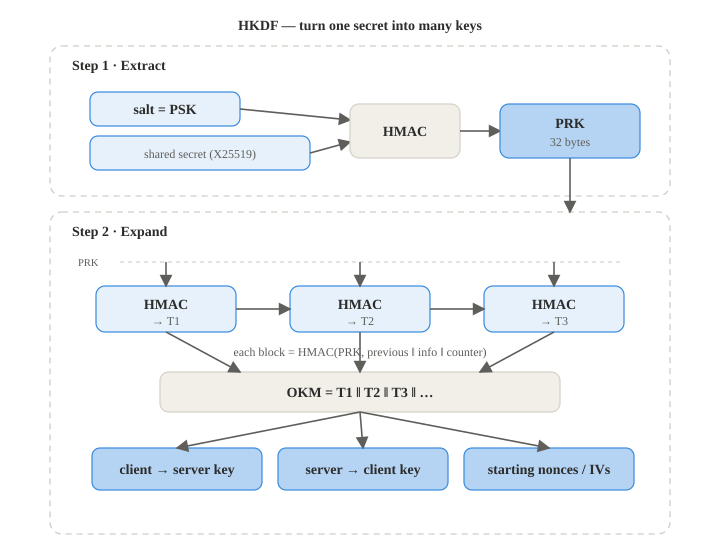

# HKDF

**RFC 5869**

**Implementation:** `primitives/hkdf.py`

HKDF turns one shared secret into several independent keys, it uses HMAC and
has two steps:

1. **Extract.** Run one HMAC over the PSK and the shared secret to get a single clean
   32byte key called the PRK. This concentrates the randomness of the secret into one solid
   key
2. **Expand.** Starting from the PRK, chain HMAC calls together, each block is
   `HMAC(PRK, previous block + info + counter)` until there are enough bytes. The "info"
   label makes each output different, so the same PRK can produce different keys for
   different purposes

In this project HKDF expands the handshake's shared secret into the two directional session
keys (client→server and server→client) plus the starting nonce material.

