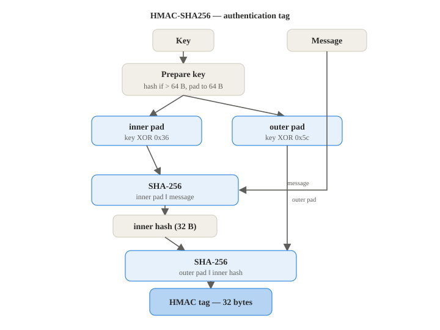

# HMAC

**RFC 2104**

**Implementation:** `primitives/hmac.py`

HMAC proves a message came from someone who knows a secret key, and that the message was not
changed. It is built on this project's SHA-256:

1. **Prepare the key.** If the key is longer than 64 bytes, hash it first, then pad it with
   zeros up to 64 bytes
2. **Two pads.** XOR the key with the byte 0x36 to get the inner pad, and with 0x5c to get
   the outer pad
3. **Hash twice.** Hash the inner pad and the message, then hash the outer pad and that
   result, this gives the 32byte tag

Hashing twice is what stops length extension attacks that a plain hash of key plus message
would allow. In this project HMAC is used in the handshake, both sides compute
`HMAC(PSK, transcript)` and stop if the tags do not match.

