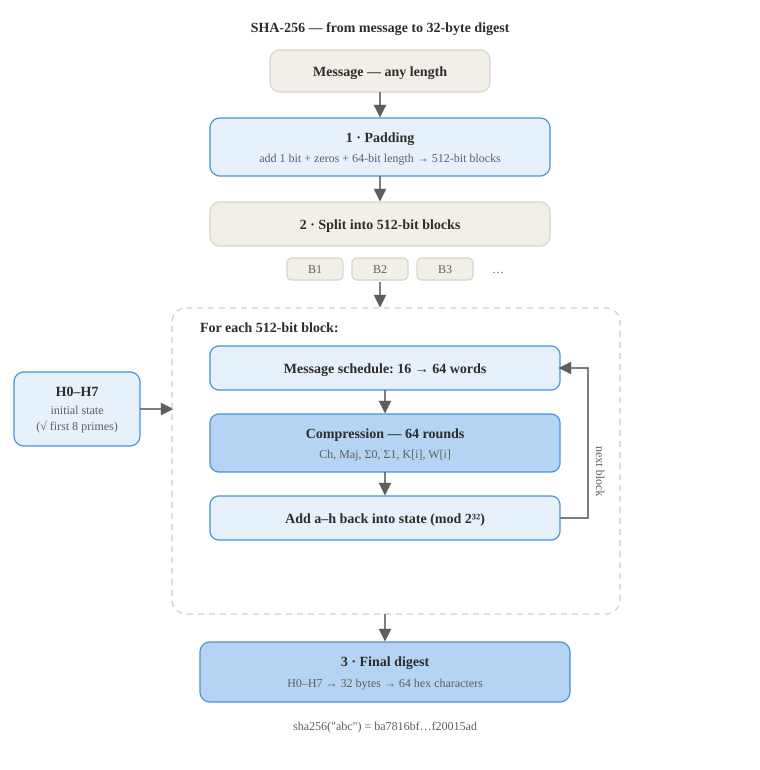

# SHA-256

**FIPS 180-4**

**Implementation:** `primitives/sha256.py`

SHA-256 takes any input and gives back a fixed 32byte (256 bit) digest. The code follows
FIPS 180-4 and works in a few steps:

1. **Padding.** We pad the message so its length fits the block size, add a single 1 bit,
   then 0 bits, then the original length as an 8byte number. This makes the total a multiple
   of 64 bytes so it splits into even blocks
2. **Starting values and constants.** Eight 32bit starting values and 64 round constants,
   fixed numbers taken from the roots of small primes
3. **Message schedule.** Each 64byte block is stretched from 16 words into 64 words, this
   spreads every input bit across many words
4. **Compression.** 64 rounds mix eight working variables using the choice and majority
   functions and bit rotations, then add them back into the running hash
5. **Final digest.** After all the blocks the eight values are joined into the 32byte digest

Every block feeds into the next one, so every byte of the input affects the final hash.

