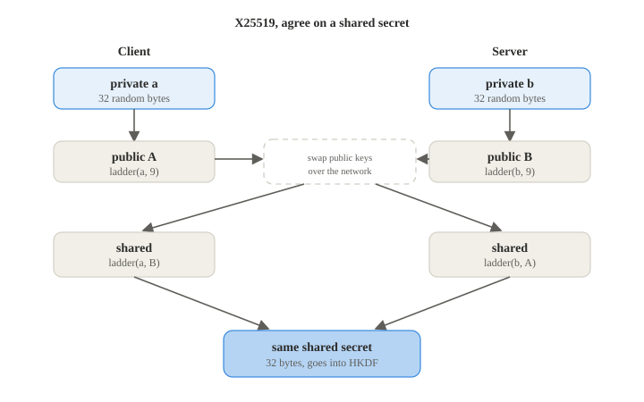

# X25519

**RFC 7748**

**Implementation:** `primitives/x25519.py`

X25519 is the Diffie-Hellman key exchange used to agree on a shared secret over an insecure
network. It is the same idea as the classic Diffie-Hellman from the course, but done on the
Curve25519 elliptic curve, which gives small keys and fast, safe math.

1. **Private key.** Pick 32 random bytes and clamp them (force a few bits on or off) so the
   key lands in a safe range
2. **Public key.** Multiply the curve's base point by the private key using the Montgomery
   ladder, a loop that walks through the bits of the key, this gives the 32byte public key
3. **Shared secret.** Each side runs the same ladder on its own private key and the other
   side's public key, and both get the exact same 32byte result

In this project the shared secret feeds into HKDF to make the session keys.

