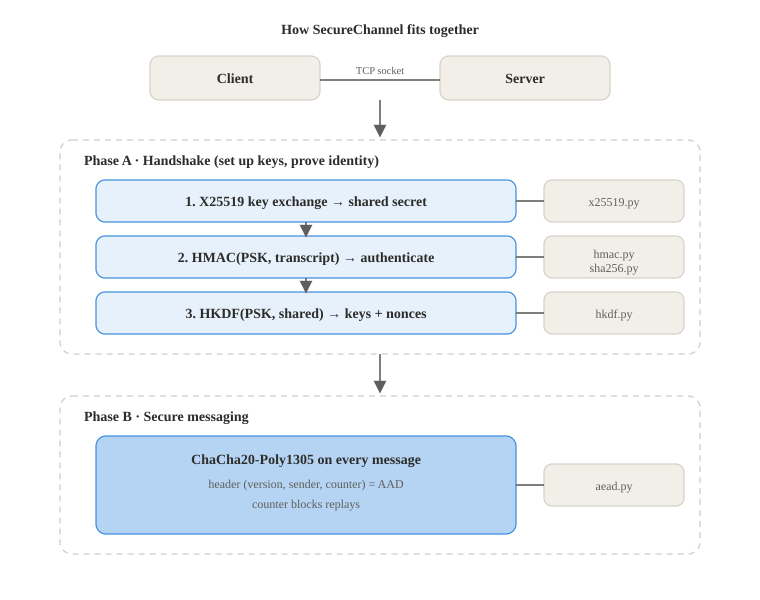
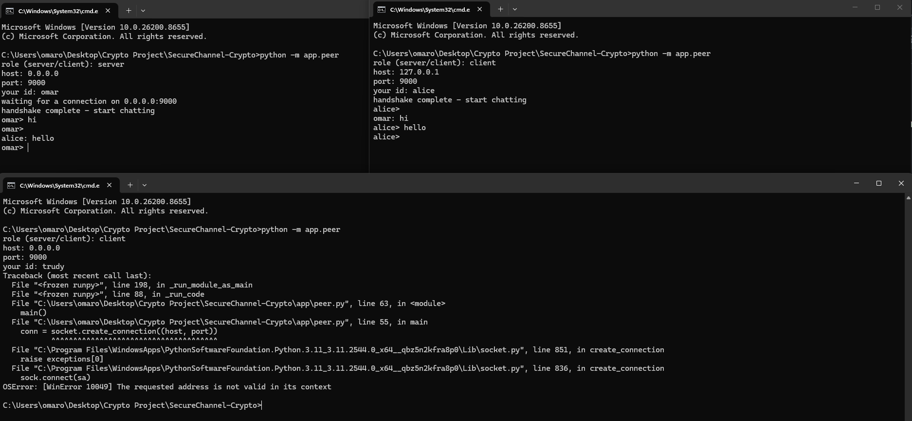

# SecureChannel-Crypto

A secure communication system in Python for Applied Cryptography Course

Two parties establish a shared secret over an insecure network, authenticate each
other, and then exchange messages with confidentiality, integrity, and authenticity.
Every cryptographic primitive is implemented from its official specification.

## Course

- **Course:** ENCS4320 — Applied Cryptography
- **Institution:** Birzeit University
- **Author:** Omar Takhman (1230002)

## What the program does

A session runs in two phases.

**Phase A — Handshake (key setup and authentication).**

1. **Key exchange.** Each side creates a temporary key pair and they run a
   Diffie–Hellman exchange over the X25519 curve to agree on a shared secret
2. **Authentication.** Both sides already share a long-term pre-shared key (PSK), agreed
   in person and read from a file. Each side computes `HMAC(PSK, transcript)` over
   the whole handshake (both public keys, both identities, the version) and sends it for
   the other side to check. If the tags don't match, the connection is aborted. This is
   what stops a man-in-the-middle attacker.
3. **Key derivation.** The shared secret is fed into HKDF (with the PSK)
   to produce two separate directional keys (client→server and server→client)
   plus the starting nonce material.

**Phase B — Secure messaging.**

1. **Authenticated encryption.** Every message is protected with ChaCha20-Poly1305.
2. **Associated data.** Each message carries a small plaintext header (version, sender id,
   and a message counter). The header is not encrypted but is authenticated, so any
   tampering with it makes decryption fail.
3. **Replay protection.** The counter strictly increases and is tied to the nonce, so
   replayed or reordered messages are detected and rejected.



## Cryptographic primitives

| Component | Specification | What it gives us |
| --------- | ------------- | ---------------- |
| [SHA-256](About/Sha256.md) | FIPS 180-4 | secure hashing |
| [HMAC](About/HMAC.md) | RFC 2104 | message authentication |
| [HKDF](About/HKDF.md) | RFC 5869 | deriving keys from one shared secret |
| [ChaCha20-Poly1305](About/ChaCha20-Poly1305.md) | RFC 8439 | authenticated encryption (with AAD) |
| [X25519](About/X25519.md) | RFC 7748 | Diffie–Hellman key exchange |

The three foundation primitives build on each other: HMAC is built on SHA-256, and HKDF
is built on HMAC.

## How to run

### Tests

```bash
python -m tests.test_phase1
python -m tests.test_2
python -m tests.test_x25519
python -m tests.test_protocol
```

The first three check the primitives against the official RFC and FIPS test vectors. The
last one runs a full handshake over a local socket and checks messaging, tampering, replay
and a wrong psk. Each file prints `pass` when everything is fine.

### Chat

The shared password is in "psk.txt", so both client and server read
the same psk. In a real system this should never be in a file like this
either its in env variables (.env file which is private or generated randomly)
here it is committed only to make testing easy

Run the peer on each side and answer the prompts (role, host, port, id). Start the server
first, then the client:

```bash
python -m app.peer
```

For a local test answer the server side with server, 127.0.0.1, 9000, bob and the client
side with client, 127.0.0.1, 9000, alice. After the handshake you can type a line and press
enter to send it, and messages from the other side show up as they arrive

### Example session


